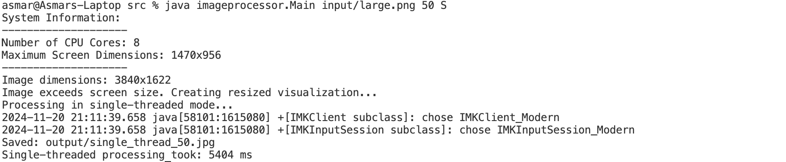
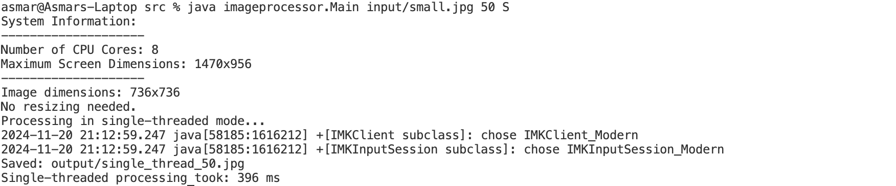
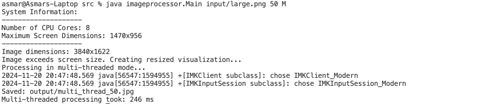
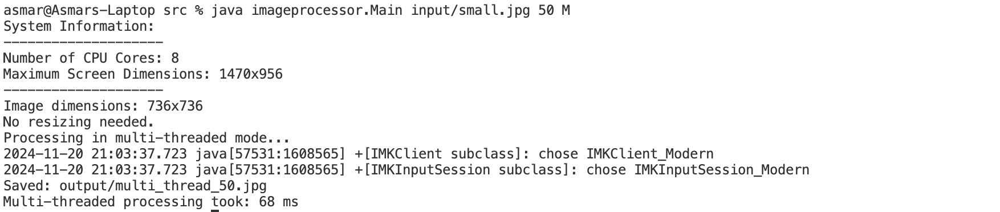
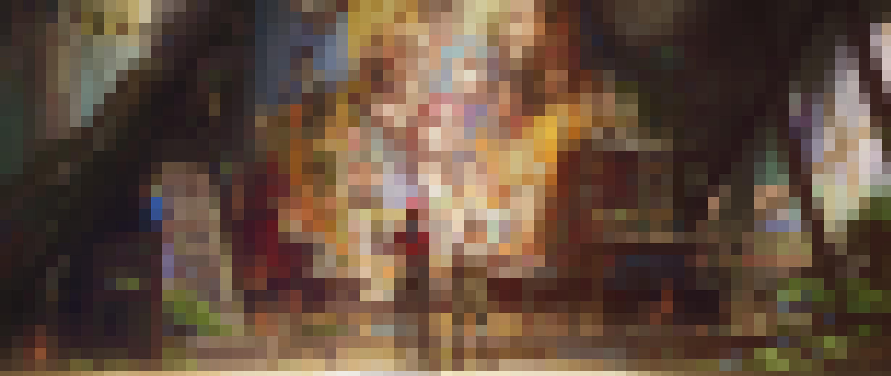

[](https://classroom.github.com/a/YybNWfh8)

# Assignment 3 - Concurrency

## Task Definition

The goal for this task is to processes images by dividing them into squares of a given size, averaging the colors within each square, and showing results for both Single-Threaded and Multi-Threaded mode. 

## Features

**1. Single-Threaded Processing**

 - Processes the image sequantially (left-to-right) from top to bottom.
 - Visualizes the progress dynamically in a resized window, if the image is larger than the screen size.
 - Saves the result in the [output](src/output/) folder

**2. Multi-Threaded Processing**

 - Divides the image into regions processed in parallel by multiple threads. 
 - Dynamically visualizes progress with simultaneous updates from multiple regions. Here, the initial approach (processing sequantially) was changed to different location for each core so that multi-threading's difference from single-threading could be shown, other than its speed.
 - Saves the result in the [output](src/output/) folder

**3. Visualization and Resizing**

 - Displays a the image as the averaging process happens. If the image size is bigger than the screen, displays processing for screen-fit visualization.
 - While it shows the resized image (if image is too big), the actual process is done on the original image at full resolution.


javac -d . imageprocessor/*.java imageprocessor/utils/*.java imageprocessor/processor/*.java

java imageprocessor.Main input/large.png 100 S

java imageprocessor.Main input/large.png 50 M 


## Folder Structure
```
└── src
    ├── imageprocessor
    │   ├── Main.java
    │   ├── processor
    │   │   ├── MultiThreadProcessor.java
    │   │   └── SingleThreadProcessor.java
    │   └── utils
    │       ├── ImageUtils.java
    │       └── ScreenUtils.java
    ├── input
    │   ├── large.png
    │   └── small.jpg
    └── output
        ├── multi_thread_50.jpg
        └── single_thread_100.jpg
```

### Components 

**1.[Main.java](src/imageprocessor/Main.java)** 

The file that uses all the other classes and utilities. This file is the only one used for running the program.

***Input arguments***: Gets input from command line for *input file name*, *square size*, and *processing mode (S / M)*.

1. Loads the input image using ```ImageUtils.loadImage```. 

2. Checks if resizing is required using ```ScreenUtils.needsResizing``` and resizes the image for visualization if needed. 

3. Invokes either ```SingleThreadProcessor``` or ```MultiThreadProcessor``` based on the selected mode.

**2. [SingleThreadProcessor.java](src/imageprocessor/processor/SingleThreadProcessor.java)** 

Handles the operation in mode 'S', meaning Single Threading. This one is slower and more sequential compared to the other mode.

1. Divides the image into squares of the specified size. (*squareSize*)

2. Calculates the average color for each square using ```ImageUtils.calculateAverageColor```.

3. Updates the processed image and visualization.

4. Saves the processed image with a name including the square size and threading mode (example: single_thread_100.jpg).

**2. [MultiThreadProcessor.java](src/imageprocessor/processor/MultiThreadProcessor.java)** 

Handles the operation in mode 'M', meaning Multi Threading. This one is faster and process is horizontal as well as sequential.

1. Divides the image into regions (horizontal slices) and assigns each region to a thread.

2. Calculates the average color for each square using ```ImageUtils.calculateAverageColor```.

3. Updates the processed image and visualization.

4. Saves the processed image with a name including the square size and threading mode (example: multi_thread_50.jpg).

**2. [ImageUtils.java](src/imageprocessor/utils/ImageUtils.java)** 

This class contains most of the helper functions like loading and resizing image, calculating the color average, and displaying the image.

Here are the functions that provides the utilities mentioned above:

 -***loadImage***: loads the input image from the specified file path.
 -***resizeImage***: resizes the image to fit within the maximum screen dimensions (for display).
 -***calculateAverageColor***: calculates the average color of each group of squares in the image.
 -***fillSquare***: fills the resulting square in the image with calculated color.

**2. [ScreenUtils.java](src/imageprocessor/utils/ScreenUtils.java)** 

Checks the screen size of the device and decides if the image will need resizing or not. Used by the Main class only. Has two helper functions:

 - ***getMaxScreenSize***: returns maximum available screen size based on device.
 - ***printSystemInfo***: prints out the number of cores and maximum dimensions for the device in the terminal screen.
 - ***needsResizing***: returns a boolean value, *true* or *false*.

## Running examples and Results 

**Single-Threaded**

This is how running an image that exceeds the maximum screen size looks like in single-threaded mode: 



Single-threaded mode with a smaller image:



**Multi-Threaded**

This is how running an image that exceeds the maximum screen size looks like in multi-threaded mode: 



Multi-threaded mode with a smaller image:



*NOTE*: for some reason, while using small image in multi-processing mode, if we set the sleep time a bit too high (even 5-10), some squares are not properly visualized. But it saves the final image correctly. To not decrease the visualization result accuracy, the sleep time is set to 1 for now in ```MultiThreadProcessor```. For a fair comparison, same thing is applied in ```SingleThreadProcessor``` as well, however, visualization bug only happens in MultiThreading (does not affect SingleThreading even at much higher sleep time).


### Result images

A large image averaged on 50 square size:



A large image averaged on 100 square size:


